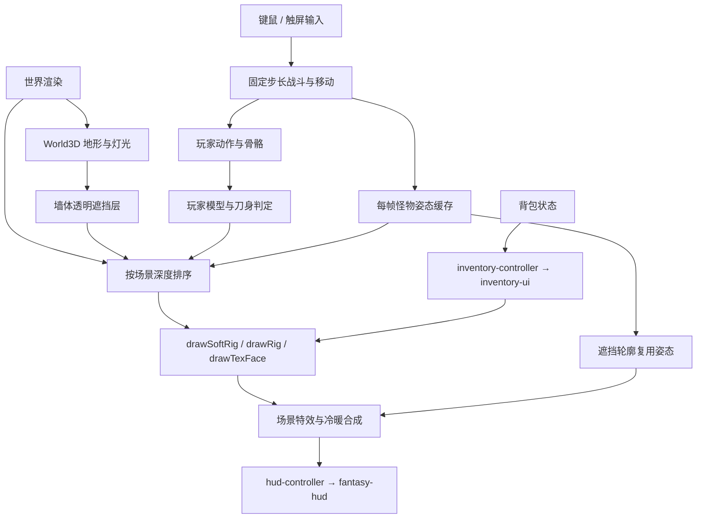

# 地牢角色渲染修复与代码链路检查

日期：2026-10-03。范围：用户指出的地牢角色异常，以及渲染、UI 接入与相关重复代码。候选为当前工作区，包含未提交的新模块；没有提交、推送或部署。

## 结果

代码修复、自动回归与右侧浏览器的基础场景检查通过。保留地形 GPU shader 和光照优化，角色由稳定的 Canvas 贴图通道绘制。用户随后明确要求右侧浏览器，已在其中检查真实 GPU 地牢、PC / 手机布局和背包。Edge、完整关卡战斗与实机手机表现仍待单独验证。

## 原因与处理

| 证据 | 影响 | 处理 |
| --- | --- | --- |
| GPU 角色材质关闭 depthTest / depthWrite，却画出立方体所有正反面。 | 背面覆盖正面，外观表现为身体破面、错位或缺失。 | 移除当前不完整的角色 GPU 接管，继续使用既有面排序。 |
| 图集的纵坐标按翻转后的坐标计算，但 CanvasTexture.flipY=false。 | 皮肤面取到错误区域；图集只收录当时已经加载的图片，也会遗漏稍后就绪的皮肤。 | 恢复每张原皮肤的 UV 绘制；不改模型与皮肤内容。 |
| actorsActive 仅凭 mesh / texture 存在就让主画布跳过角色。 | shader 未成功或角色容量不足时，仍关闭正常角色绘制；状态、眨眼、选中边框和画家排序也不完整。 | 地形成功与角色绘制解耦；移除该接管标记及其调用入口。 |
| 项目内 Three r186 的 Lambert shader 没有 vViewPosition，新增柔光却引用它。 | 编译失败；Three 默认记录错误，主程序可能仍误判地形绘制成功。 | 使用实际正交视线方向，法线沿用 Three 的 transformedNormal，实例位置乘 instanceMatrix；编译错误转入 frame 的回退。 |
| 受击 / 倒地时通过重建 BX 复制部分字段，倒地遗漏 tx。 | 倒地丢皮肤；新增法线或细部标记可能在变形中丢失。 | 变形只替换矩阵，保留其他字段；本体与遮挡轮廓共用同一姿态。 |
| 贴图面提前返回，原色调逻辑只影响无贴图面。 | 冰冻角色仅武器染色，皮肤不变。原生 Canvas 的头部像素比较在修复前失败。 | 色调进入贴图绘制；按 0.05 强度量化复用，缓存最多 256 张。 |
| drawSoftRig 和局部 Canvas 状态缺少异常恢复。 | 一次绘制异常会污染后续场景或背包的角色状态。 | 使用 try / finally 归还 softShader、画布变换、透明度和绘制状态。 |

角色当前选择 Canvas 是兼容现有墙体贴回、箱子、掉落和特效排序的具体修复。以后重新接入 GPU 角色，需要完整验证深度、镜头坐标、各面 UV、透明度、眨眼、装备状态、容量及跨画布遮挡顺序。

## 当前有效链路

材质和背包只影响绘制；刀身判定继续沿用 hitRig / bladeSegs。没有通过修改模型比例或扩大攻击范围掩盖画面问题。

## 代码清理与性能证据

- 移除无有效接入的角色 GPU 材质、图集、颜色缓存和提交入口。改动前原文件留在 `tools/refs/render-recovery-20261003/`，可恢复该实验代码。
- 活体怪物原先最多经过 GPU 预提交、本体绘制、遮挡轮廓三次建模。现在每帧只生成一次，轮廓直接复用；下一帧清空缓存。回归验证了两帧累计生成两次。
- 删除旧 reference HUD、旧纸娃娃、旧 tooltip、旧触屏按钮、小地图及冷却图标的无调用绘制；保留真实外观规则、地图页面、背包业务和新 PNG UI 模块。
- 去掉旧布局常量、旧染色 / 幻化按钮坐标、未使用 glow 参数及头像临时变量。逐一检查实际加载脚本中的调用；没有删除用户备份、模型或素材。
- 与本轮修复前快照相比，HTML 净减少 382 行，world3d.js 净减少 132 行，合计约 38KB。行数含原有嵌入资产与空行，不是性能指标。
- 原皮肤 / 模型数据段逐字比较一致（仅规范换行后比较）。回归验证的是模型生成次数、缓存容量和行为正确性；没有据此宣称帧率提升。

## 验证

1. 修复前新增的 7 项行为回归均失败；修复后通过。另补充 1 项贴图复用与容量回归。
2. `node --test tests/*.test.cjs`：127 项通过、0 项失败。覆盖原战斗、武器变招、手机判定、HUD、背包和 I 键动效，并增加角色渲染检查。
3. shader 检查加载仓库实际 `vendor/voxel-world.js`，使用其 Three r186 Lambert 输入；渲染器替身注入编译失败，检查上层返回 false、隐藏 WebGL 画布及新地图恢复。它没有执行真实 GPU 编译。
4. `node tests/render-characters.cjs`：实际角色 / 武器模型、皮肤 PNG、Canvas 绘制函数，生成四角色三姿态、受击 / 冰冻 / 透明度、PC 与手机场景。头部像素检查确认冰冻皮肤发生变化。已打开检查角色连接、皮肤面、武器与状态效果。
5. JavaScript 与 HTML 内联脚本语法检查、Git 差异空白检查通过。

## 真实浏览器补充验收

用户指出原生检查图的地图与实际游戏不同，并明确要求打开右侧浏览器。原生图使用固定种子的受控局与 2D 地形回退，只用于角色绘制检查。右侧浏览器当时只有视频标签，没有已有游戏页；打开同一 `http://127.0.0.1:8000/weapon-lab.html` 后新建试玩局。该局使用真实随机地图生成器，不会复制用户旧截图的房间布局。

- 实际内嵌游戏加载 `world3d.js?v=17`，控制台报告 Three r186 就绪与苔石地牢构建完成。砖墙、苔藓、石地板、火把与柔光成功呈现，角色头部、身体、装备和武器正常连接。
- PC 默认视口 2035×1244；手机测试外层视口 844×470，实验室标题栏占 81px，实际游戏视口 844×389。同一局切换布局，没有重生成地图。
- GPU 诊断：NVIDIA GeForce RTX 3070 Ti / ANGLE；`ok=true`、`vis=visible`、`failed=false`、`lost=false`、`ctxLost=false`、`wlAlphaOK=true`、`actorRenderer=canvas`。成功运行实际 GPU 地形及透明遮挡层。
- 浏览器中通过 HUD 打开 / 关闭 PC 与手机背包，看到实时皮肤、武器、石台与属性。I 键自动化曾遇到 iframe 焦点及字符键名问题，没有将它记为完整浏览器键盘验收；逻辑动效回归保持通过。
- 检查日志没有游戏 shader 编译错误。页面刚打开、游戏开始前记录了 1 条无来源 URL 的 MutationObserver.observe 节点错误；项目 JS / HTML 没有使用 MutationObserver，来源仍未定位，保留原日志，未据此宣称控制台完全无错误。
- 诊断中本场景地形有 24 批次、约 188 万顶点；这是结构计数，不能当作 FPS 或手机性能结论。真实设备帧时间与完整关卡仍需取样。
- 完成后恢复浏览器默认视口及自动布局，将真实游戏页留在右侧。

真实截图：`assets/render-qa/browser-pc-dungeon.jpg`、`browser-pc-inventory.jpg`、`browser-mobile-dungeon.jpg`、`browser-mobile-inventory.jpg`。浏览器截图与原生 PNG 检查图分开保存；诊断和完整记录在 `browser-logs.json`。

检查图：`assets/render-qa/characters.png`、`character-statuses.png`、`dungeon-pc.png`、`dungeon-mobile.png`。这些场景使用 2D 地形回退，不能证明 GPU 地形合成正确。图片解码器与浏览器图片对象的尺寸接口差异也仅在本地检查工具内修正。

## 后续结构整理

当前游戏入口仍包含大量战斗、装备数据和嵌入模型。后续拆分可以先把角色渲染与皮肤缓存独立成模块，再把嵌入数据迁到资源文件；需保留原有数据归属和输入 → 模拟 → 判定 → 绘制的顺序。此轮先解决实际回归与重复工作，没有同时改写战斗架构。完整 CPU / GPU 帧时间和真实手机手感需要设备证据后再优化。

## 修改保护

修复前保存了 HTML / world3d.js 快照与 SHA-256 清单。修改时核对文件是否发生外部变化，保留其他 IDE 新增的地形柔光、色彩空间、tone mapping、火把和最后的冷暖合成。

修复前：HTML `4ad5da339c6f5e9cc3d6256474c0f2f5dc8aad18c8ec5a4e95553cf74b25df8e`；world3d.js `872acfad63a0390dd9a0ef0faac1c0219c2932e0272b79ee28a29fa6214e9409`。修复后清单在 `assets/render-qa/source-manifest.json`。

## 视频参照第一轮

直接使用用户已打开的[《我的世界地下城2试玩！看看适不适合自己！》](https://www.bilibili.com/video/BV1Gtap6NEVp/)，观察 12:52 的通道边界、15:02 的拾取光、18:44 的角色接触阴影及 21:03—21:25 的战斗、数字与环境层次。只记录实际查看的片段，没有把整段 48 分钟视频记为完成观看，也没有将视频说明和评论当作实施指令。

落地内容：苔石墙顶从纵向长条石改为双向 8 体素分块压顶，砖缝铺底完整，墙高与碰撞尺寸相同；世界玩家的面明暗提高 0.14，原始模型与皮肤载荷逐字核对保留；接触阴影使用缓存的渐变精灵，离地时变淡。近战拖尾收窄为刀尖附近的透明月牙，普通混合取代叠加过曝。普通数字字号由 22 基准改为 18，约 0.95 秒退出；非数字说明保留阅读时间。血条增加 0.12 秒停留、0.5 秒收拢的金色尾迹，连续命中从当前可见尾迹继续，不改写伤害和死亡结算。普通体素怪的常驻头顶圈与目标整身描边移除，精英 / 首领标识和手机脚下目标环保留。PC 显示指针，攻击 / 拉弓时显示缩小的落点。

验证：132 项回归通过，包含新增的墙顶完整性、血量尾迹、重复死亡、飘字寿命、指针分工检查。实际浏览器加载 `world3d.js?v=18`，GPU 诊断 `ok=true`、`failed=false`、`lost=false`、`wlAlphaOK=true`、`actorRenderer=canvas`；最新加载与试玩日志中没有 warn / error。通过手机 HUD 的攻击按钮观察到真实近战动作与拖尾。

本轮截图在 `assets/render-qa/video-pass-1/`：`browser-pc-after.jpg` / `browser-mobile-after.jpg` 是实际浏览器 GPU 地形；`combat-pc.png` / `combat-mobile.png` 是固定战斗状态、真实资产及 Canvas 函数的原生检查，背景为 2D 回退。`browser-before.jpg` 与刷新后的截图使用不同随机局，不用于逐像素对比或性能结论。保存前快照在 `tools/refs/video-pass-1-20261003/`，当前文件清单在同目录截图资源的 `source-manifest.json`。这一轮没有测量 FPS 提升，手机布局验证也不等于完整真机触屏验收。

## 场景与角色视觉第二轮

用户明确本轮重点为场景和角色效果。继续使用同一个已打开的视频标签，观察约 40:28 的石材边界、环境冷暖、边缘植物与战斗光效。苔藓沿墙根 / 裂缝聚集是本项目的美术假设，没有把噪声字段描述成实测湿度、日照或生态数据。

落地内容：

- 苔石地牢移除带绿色立方体的 `mossy_floor` 整格资源，改用低矮苔藓垫和两种蕨叶簇；屋顶苔藓也使用不规则簇。生长区限定墙根，中央和单格通道裸露；门格、出口与完整模型占地均参与排除。候选 ID、存在概率、半径、方向和造型使用独立随机通道；同种子低 / 中 / 高密度检查为 24 / 43 / 57 簇，增加密度不重排已有候选。
- 根据邻近墙体与世界位置将墙脚渐暗、冷色和缓慢材质变化烘焙进地板顶点颜色。源几何、法线和颜色保持原值；继续使用既有分块合批。地牢天空光、地面回光与曝光略降，玩家点光收敛到 1.65 基准，火把外晕与核心缩小。地牢雾与光柱减弱，尘粒缩小成缓存软点，只在地面及局部灯光附近明显可见。
- `scene-style.js` 统一拥有地形散布和角色光照采样。每帧限制为附近八盏火把及三处短暂效果光，单个角色先进行距离和视线检查，再按方块面朝向绘制。世界角色呈现冷色环境光、暖色火把，以及冰霜 / 治疗 / 爆炸 / 金色效果光；效果沿原寿命衰减，不修改原效果对象。受击与冰冻色调优先，光照参数在正常及异常退出时均归还；背包与选角使用原独立预览光。
- 武器绘制只附带金属面标记和朝向高光，不改变组件、皮肤、骨骼或刀身判定。原 MCTEX / 模型载荷段规范换行后逐字比较一致。
- 实际试玩发现冰霜新星原先的中心白光遮住身体：青色冲击改用透明冷光和细边，扩散环、冰片、技能范围和伤害沿用原逻辑。PC 与手机实际按钮均释放成功，蓝量真实扣除，截图中仍可辨认身体与武器。

证据在 `assets/render-qa/scene-character/`：`character-lighting.png` 为实际生产皮肤、模型与武器在独立预览光、冷色环境光、火把及冰霜光下的原生 Canvas 检查；`moss-distribution.png` 为密度摆放图，不是 GPU 场景渲染。`browser-pc.jpg` / `browser-mobile.jpg` 记录第一轮接入；`browser-pc-final.jpg` / `browser-mobile-final.jpg` / `browser-frost.jpg` / `browser-mobile-frost.jpg` 记录包含技能光和收紧中心亮斑的最终实际浏览器版本。刷新生成了不同随机地图，前后截图不用于逐像素比较。用户原有的游戏标签页保留，新标签页用于验证并留下最终预览。

`node --test tests/*.test.cjs` 最终 142 项通过。新增检查覆盖完整叶尖占地、候选稳定性、通道与出口留白、墙脚颜色烘焙、光源隔墙与寿命、状态色调优先以及光照状态归还。独立几何计数见 `plant-geometry.json`，使用顶点颜色而无纹理贴图；最终浏览器主场景诊断为 23 批次、2,230,998 个顶点、743,666 个三角形，PC 游戏视口 1280×639 / 手机布局视口 844×389，`ok=true`、`failed=false`、`lost=false`、`wlAlphaOK=true`、`actorRenderer=canvas`。这些为当前随机地图的绘制计数，不是帧率改善或真实手机性能结论。

完整日志留在 `browser-logs.json`。页面启动时还记录无来源 URL 的 MutationObserver 错误；本项目实际加载的 HTML 与脚本均未使用该 API，未据此定位为游戏代码缺陷，也未把日志记成零错误。实际 World3D 诊断和本次加载未显示 shader 编译失败或上下文丢失。文件快照在 `tools/refs/scene-character-20261003/`，最终载荷哈希在截图目录 `source-manifest.json`。

## 战斗动作衔接 · 2026-10-04

用户本轮要求优化角色战斗动态。将三个实验武器的视觉增强收进 `combat-motion.js`：重武器通过后坐、前送、动态支撑脚和扶柄手表达重量；双镰通过守势手、交替出手与旋身支撑步保持身体参与。蓄力接出手、连招提前截断收势、收势归于真实待机腕角都有连续过渡。衔接按每次攻击 ID 和实体保存，转向走最短角度，起手过渡最长 55ms 且不超过蓄力时间的 55%。双镰剪击原蓄力末端与有效段起点相差 0.07 rad，已在视觉蓄力中提前对齐。

显示姿态只进入 `playerRig` / `rigModel`；判定仍调用原 `hitRig` / `playerPose`，拖尾跟随真实显示刀身。模型矩阵增加显示朝向偏移。附属动画移除原 `pose.spin ? 0 : 0` 无效项，改为实际显示转向 / 旋风角速度；运动输入包含 `mvx` / `mvy`。世界角色模拟时间只在玩家更新推进，暂停及命中停顿不会让附属摆动脱离身体。没有世界时钟的选角 / 背包实体保留原呼吸链路，动画记录不跨实体或换武器复用。

153 项检查通过，新增 11 项覆盖三武器全部普通动作与变招阶段、骨骼数值与贴图归属、支撑脚、跨 π 转向、暂停重复建模、翻滚中断、预览及换武器、附属摆动、高攻速和长帧。高攻速测试用三种武器分别跑 240 个真实玩家更新，启用 / 关闭新姿态时逐帧比较攻击状态、时机、位置与敌人生命值一致，并要求实际命中。当前 MCTEX / 模型载荷段、`playerPose` / 法杖姿态与 `hitRig` 判定段相对开始快照规范换行后逐字一致；武器模型与变招逻辑文件的 SHA-256 未改变。

证据在 `assets/render-qa/combat-motion/`：`three-weapons.gif` / `pose-sheet.png` 使用生产模型、皮肤与武器，由原生 Canvas 绘制；按 120 Hz 采样姿态，GIF 以 30 Hz 保存，并核验播放时长。此预览使用受控站立角色，不等于实际 GPU 录屏或性能数据。`browser-*-mobile.jpg` 与 PC 截图是右侧浏览器实际地牢画面。新预览页完成三武器攻击按钮检查，用户原有游戏页保留。源文件清单与保护段核对结果在 `source-manifest.json`；保存前快照在 `tools/refs/combat-motion-20261003/`。浏览器日志仍包含既有无来源 MutationObserver 错误，未因此宣称零错误，也没有测量 FPS 提升。手机布局检查不代表真机触屏手感验收。

## 场景石材与 Blockbench 素材 · 2026-10-04

用户要求对照已打开的地下城 2 视频优化场景，并明确密集地砖应替换。本轮查看新打开的[试玩视频](https://www.bilibili.com/video/BV1Z9ar6FEqq/)，保存约 2:21 的参考帧；主要观察户外据点的大石板、破损边缘、石台、植物聚簇与局部暖光，将这些形状层次用于现有冷色苔石地牢，不声称完整复刻地下场景，也未将视频评论作为指令。

制作六类程序素材：缺角、斜裂、破角石板；带墙脚、四块压顶石和间隔壁柱的墙体；分层石柱；低矮碎石。石板顶面仍为 0，完整砂浆铺底在下方，墙与道具的模型足迹保持原格内。墙体最高点仍为原墙高加 2 单位。装饰使用既有缓存与合批，苔藓位置保留；苔石地牢的贴墙小摆件略靠近墙根，并避开出口中心。地图生成、房间数据、碰撞和角色链路没有改动；其他四主题的配置逐项核对相同。

通过本机 Blockbench MCP 1.10.0 / Blockbench 5.2.1 建立独立候选项目，原生创建网格、指定自制 104×16 调色板和 UV。实际正面及背面检查后，通过原生 project 编解码导出 `assets/scenes/moss-stone/moss-stone.bbmodel`，在另一项目解析导入，核验 44 个网格、1 张贴图、全部顶点与面、UV 色块以及嵌入贴图像素。原生编解码将坐标保留到五位小数，最大偏差为 0.000004602 单位。重新导入后恢复项目 UV 尺寸，正面图与导出前像素相同。原用户未保存的树模型项目保留；只使用独立离屏镜头拍摄。离屏删除工具返回 `onContextMenu is not defined`，随后 `list_views` 确认离屏注册已移除；未重启或修改 Blockbench 插件。

权威源为 `scene-assets.js`，`tests/build-scene-assets.cjs` 可重复生成模型数据、调色板及 MCP 输入。运行时从同一源生成原地形管线所需顶点颜色网格；原生 bbmodel 作为可编辑交付保存。`review.json` 包含来源、相机、视觉自查、技术检查、保留范围与哈希；用户视觉接受仍待反馈。

浏览器实际游戏视口为 PC 1280×639、手机布局 844×389。最终手机诊断：`ok=true`、`failed=false`、`lost=false`、`ctxLost=false`、`wlAlphaOK=true`、`actorRenderer=canvas`；当前随机地图 31 个批次、965,988 个顶点、321,996 个三角形。固定验收房间使用同一 27×21 地图、1280×800 视口、相机、灯位及 1000ms 时间，原版 248,184 个三角形，新版 81,120 个，均为 10 批次。前后图与实际游戏图明确区分；固定房间不是用户当前地图，GPU 计数不代表 FPS 或真机性能。

最终 161 项检查通过。新增 8 项覆盖闭合网格、每面向外法线、缺角石板铺底与地平面、墙顶高度、柱台接触、原资源回退、渲染不改地图、其他主题配置，以及原生导出 / 重导入与 UV 贴图像素。复原 HTML 两条加载变更并规范换行后，哈希等于开工前记录；武器模型、战斗姿态、变招、场景散布和特效文件哈希均未改变。日志保留已有无来源 MutationObserver 错误，没有记为零错误。证据与清单在 `assets/render-qa/scene-style/`，保存前快照在 `tools/refs/scene-style-20261004/`。

## 地面破损概念落地 · 2026-10-04

用户指出破损和碎裂不自然，先以实际固定地牢截图及已查看的视频参考帧生成概念；随后用户要求继续，本轮落地该方向。概念保存为 `assets/scenes/moss-stone-v2/floor-concept.png`。重点是完整大石板、局部不规则缺口、土层和贴着破口的碎片，减少反复出现的整块斜切与黑色缺角。概念中的细微石材表面纹理尚未完整实现，本轮保留原有顶点颜色和 shader。

`scene-assets.js` 的石板增加真正凹入的轮廓与相邻边偏移倒角，凹形顶 / 底面采用耳裁三角化。两种损坏各三个种子轮廓；铺底整格连续，破损格使用土色，掉落碎片底面与铺底顶面接触、最高点低于原脚面。验证发现小碎片局部插入存留石板，已调整三个对应原生网格的位置，并核对完整片体位于破口内。

`floorTreatment` 使用世界坐标稳定选择变体、破损概率与朝向。低频字段使墙根损坏成局部区域，室内道具脚边偏向一侧；宽阔中央仅有极少破损。直接邻墙与第二圈邻墙分开处理，门格 3×3 范围、出口中心 1.8 格半径及一格宽通道排除。石材变体与存在概率使用不同通道，保护区不改变该格材质变体。`world3d.js` 仅接入地面选择和旋转，道具下方保留完整底板；原碰撞、地图数据、角色和其他四主题沿用。HTML 仅提升两个脚本加载版本。

原生 v2 含九块地面变体展示、原墙 / 柱 / 碎石，共 66 网格与一张 128×16 调色板。最终通过 Blockbench 原生 project 编解码导出，并在独立项目重导入；使用显式顶点键 / 面键逐项比较，避免数字键枚举顺序造成错误。UV、嵌入 PNG 和调色板逐像素一致，导出前与重导入后的同相机 PNG 完全相同。用户未保存的树模型项目保留。

166 项回归检查通过。新增 5 项覆盖碎片接地与缺口占地、墙边 / 中央的损坏比例与遍历稳定性、门与出口 / 窄通道保护、各损坏轮廓及旧建筑几何、当前游戏源与原生布局一致。原有场景法线检查扩展到凹形实体的逐三角面内外采样，原生核对更新为 v2。

`tests/floor-damage-review.html` 使用与 v1 对照相同的 27×21 地图、1280×800 镜头、灯位与 1000ms 时间。可行走地面 250 块，其中 204 完整、46 局部损坏；上一版 / 本版为 81,120 / 82,116 三角形，均 10 批次，新结构多 996 三角形，约 1.23%。此固定房间不代表用户当前地图或 FPS 改善。实际 PC 与手机布局用新预览标签检查，原游戏标签保留；截图与日志见 `assets/render-qa/floor-damage-v2/`。浏览器仍保留既有无来源 MutationObserver 错误，未记录为零错误；手机布局与按钮检查不代替真机性能和触感验收。

## 石材表面 shader · 2026-10-04

用户在破损落地过程中要求添加 shader，降低石块的玩具感。新增独立 `stone-material.js`，共享场景几何改用 `stone` 材质标记；普通道具、其他主题、角色与原 `styleMat` 保留，stone 模块缺失时使用普通顶点颜色 Lambert 材质。原生模型及几何数据没有改动，只在运行时增加材质表面。

shader 基于项目真实 Three r186 Lambert，保留原灯光、阴影、色彩空间与雾块。三档世界坐标噪声承担矿物斑驳、中尺度浅孔与细颗粒，使用无三角函数哈希，每个材质片元固定 12 次哈希。高频部分随屏幕足迹平滑归于均值；表面无需 UV 或时间，随相机移动不会在屏幕上漂移，也不逐帧改变图案。既有灰石顶点颜色参与基色，斜面倒角压低约 12% 基色，石材不使用普通道具的脉动边缘辉光。

凹凸仅扰动片元法线，不改变几何、碰撞、轮廓、遮挡或角色皮肤。新增自己的视图位置 varying，从真实 `mvPosition` 获取，避免 Lambert 未启用宏时缺少通用 `vViewPosition`。视图空间表面梯度以屏幕导数计算，并对退化行列式做保护。shader 挂载发现不兼容块时显式报错，由原地形的编译失败回退处理。

170 项检查通过。新增 4 项覆盖生产 Lambert 输入与保留块、不兼容输入、材质标记前后几何 / 法线 / 颜色逐项一致、地形适配与模块缺失回退。几何阶段对照页面冻结为本轮前保存的 v2 源，最新材质对照使用 `tests/stone-material-review.html`。相同 27×21 房间与镜头中，三角形均为 82,116，着色前 / 后批次为 10 / 16；增加批次是石材与原道具拆用不同材质的成本，没有测量 FPS。实际 GPU 截图、PC / 手机布局与日志保存至 `assets/render-qa/stone-shader/`，手机布局验证不代表真机帧率验收。
